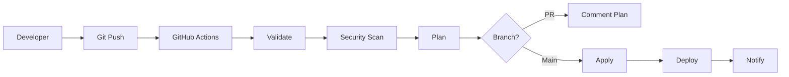

# 🏗️ Proyecto IaC Security - Infraestructura como Código

[](https://terraform.io)
[](https://aws.amazon.com)
[](https://checkov.io)
[](https://github.com/features/actions)

## 📋 Índice

- [📖 Descripción del Proyecto](#-descripción-del-proyecto)
- [🎯 Objetivos](#-objetivos)
- [🏛️ Arquitectura](#️-arquitectura)
- [🔧 Tecnologías Utilizadas](#-tecnologías-utilizadas)
- [📁 Estructura del Proyecto](#-estructura-del-proyecto)
- [⚡ Inicio Rápido](#-inicio-rápido)
- [📚 Guía Completa por Fases](#-guía-completa-por-fases)
- [🔐 Características de Seguridad](#-características-de-seguridad)
- [🚀 Pipeline CI/CD](#-pipeline-cicd)
- [📊 Comandos Útiles](#-comandos-útiles)
- [🛠️ Troubleshooting](#️-troubleshooting)
- [📖 Glosario de Términos](#-glosario-de-términos)

## 📖 Descripción del Proyecto

Este proyecto implementa una **infraestructura completa, automatizada y segura** utilizando **Infraestructura como Código (IaC)** con enfoque en **DevSecOps**.

### ✨ Características principales:

- 🏗️ **Infraestructura modular** con Terraform
- 🔒 **Seguridad por diseño** desde el inicio
- ✅ **Validaciones automáticas** de código y seguridad
- 🚀 **Pipeline CI/CD** completamente automatizado
- 📊 **Monitoreo y logging** integrado
- 🔄 **Idempotencia** y reproducibilidad garantizada

## 🎯 Objetivos

### 🎯 Objetivo General

Diseñar y desplegar una infraestructura automatizada basada en código que implemente servicios básicos (red, cómputo, almacenamiento y seguridad), integrando controles de seguridad y validaciones automáticas en un flujo CI/CD bajo el enfoque GitOps.

### 📝 Objetivos Específicos

1. ✅ Modelar infraestructura segura y reproducible con Terraform
2. 🔐 Implementar medidas de seguridad desde el código
3. 🔍 Integrar validaciones automáticas con Checkov y TFLint
4. 🚀 Diseñar pipeline CI/CD automatizado
5. 📚 Documentar arquitectura y decisiones técnicas

## 🏛️ Arquitectura

```
┌─────────────────────────────────────────────────────────────┐
│                        VPC (10.0.0.0/16)                   │
│  ┌─────────────────────┐    ┌─────────────────────────┐   │
│  │   Public Subnet     │    │   Private Subnet        │   │
│  │   (10.0.1.0/24)     │    │   (10.0.2.0/24)        │   │
│  │                     │    │                         │   │
│  │  ┌───────────────┐  │    │                         │   │
│  │  │     EC2       │  │    │     (Futuras            │   │
│  │  │   Instance    │  │    │      instancias)        │   │
│  │  │   + WAF       │  │    │                         │   │
│  │  └───────────────┘  │    │                         │   │
│  └─────────────────────┘    └─────────────────────────┘   │
│           │                              │                │
│  ┌─────────────────────┐           ┌──────────┐           │
│  │  Internet Gateway   │           │ NAT GW   │           │
│  └─────────────────────┘           │(Future)  │           │
└─────────────────────────────────────┴──────────┴───────────┘
           │
    ┌─────────────┐                      ┌─────────────────┐
    │  Internet   │                      │   S3 Bucket     │
    │             │                      │   (Encrypted)   │
    └─────────────┘                      └─────────────────┘
```

### 🔧 Componentes Principales:

- **VPC**: Red virtual privada con subredes pública y privada
- **EC2**: Instancia con configuración de seguridad avanzada
- **S3**: Almacenamiento cifrado con versioning
- **IAM**: Roles y políticas con privilegios mínimos
- **Security Groups**: Firewall a nivel de instancia
- **WAF**: Protección de aplicaciones web
- **Secrets Manager**: Gestión segura de credenciales

## 🔧 Tecnologías Utilizadas

| Categoría    | Herramienta     | Versión | Propósito                       |
| ------------ | --------------- | ------- | ------------------------------- |
| **IaC**      | Terraform       | 1.6+    | Provisioning de infraestructura |
| **Cloud**    | AWS             | -       | Proveedor de nube               |
| **Security** | Checkov         | Latest  | Análisis de seguridad           |
| **Linting**  | TFLint          | Latest  | Calidad de código               |
| **CI/CD**    | GitHub Actions  | -       | Automatización                  |
| **VCS**      | Git             | -       | Control de versiones            |
| **Scripts**  | PowerShell/Bash | -       | Automatización local            |

## 📁 Estructura del Proyecto

```
proyecto-modulo2-diplomado/
├── 📁 .github/workflows/           # Pipelines CI/CD
│   ├── terraform-cicd.yml          # Pipeline principal
│   └── terraform-destroy.yml       # Pipeline de destrucción
├── 📁 modules/                     # Módulos reutilizables
│   ├── 📁 network/                 # VPC, subnets, routing
│   │   ├── main.tf
│   │   ├── variables.tf
│   │   └── outputs.tf
│   ├── 📁 compute/                 # EC2, security groups
│   │   ├── main.tf
│   │   ├── variables.tf
│   │   ├── outputs.tf
│   │   └── user_data.sh
│   ├── 📁 storage/                 # S3, EBS
│   │   ├── main.tf
│   │   ├── variables.tf
│   │   └── outputs.tf
│   ├── 📁 security/                # IAM, WAF, policies
│   │   ├── main.tf
│   │   ├── variables.tf
│   │   └── outputs.tf
│   └── 📁 secrets/                 # Secrets Manager, Parameter Store
│       ├── main.tf
│       ├── variables.tf
│       └── outputs.tf
├── 📁 environments/                # Configuraciones por ambiente
│   └── 📁 dev/                     # Ambiente de desarrollo
│       ├── main.tf                 # Configuración principal
│       ├── variables.tf            # Variables del ambiente
│       ├── outputs.tf              # Outputs del ambiente
│       ├── terraform.tfvars.example # Ejemplo de variables
│       └── iac-key.pub            # Clave pública SSH
├── 📁 scripts/                     # Scripts de automatización
│   ├── validate.ps1               # Validación en Windows
│   └── validate.sh                # Validación en Linux/Mac
├── 📄 .tflint.hcl                 # Configuración TFLint
├── 📄 .checkov.yml                # Configuración Checkov
├── 📄 .pre-commit-config.yaml     # Hooks de pre-commit
├── 📄 .gitignore                  # Archivos ignorados por Git
├── 📄 Makefile                    # Comandos automatizados
└── 📄 README.md                   # Esta documentación
```

## ⚡ Inicio Rápido

### 📋 Prerrequisitos

```bash
# Herramientas necesarias
- Terraform >= 1.6.0
- AWS CLI configurado
- Git
- Editor de código (VS Code, Cursor, etc.)
```

### 🚀 Despliegue en 5 minutos

```bash
# 1. Clonar repositorio
git clone https://github.com/TU_USUARIO/iac-security-project.git
cd iac-security-project

# 2. Configurar variables
cp environments/dev/terraform.tfvars.example environments/dev/terraform.tfvars
# Editar terraform.tfvars con tus valores

# 3. Generar claves SSH
cd environments/dev
ssh-keygen -t rsa -b 4096 -f iac-key -C "iac-project"
cd ../..

# 4. Inicializar y desplegar
make init
make validate
make plan
make apply
```

## 📚 Guía Completa por Fases

### 🏗️ **FASE 1: Preparación del Entorno**

#### Objetivo

Configurar herramientas y estructura básica del proyecto.

#### Comandos

```bash
# Verificar herramientas instaladas
terraform --version
git --version
aws --version

# Configurar AWS CLI
aws configure
# AWS Access Key ID: [tu_access_key]
# AWS Secret Access Key: [tu_secret_key]
# Default region: us-east-1
# Default output format: json

# Crear estructura del proyecto
mkdir iac-security-project
cd iac-security-project
mkdir -p modules/{network,compute,storage,security,secrets}
mkdir -p environments/dev
mkdir scripts
```

#### Archivos creados

- ✅ Estructura de carpetas
- ✅ README.md inicial
- ✅ .gitignore

---

### 🌐 **FASE 2: Infraestructura Base (Red)**

#### Objetivo

Crear VPC con subredes pública y privada, routing básico.

#### Componentes

- **VPC**: 10.0.0.0/16
- **Subred pública**: 10.0.1.0/24
- **Subred privada**: 10.0.2.0/24
- **Internet Gateway**
- **Tablas de rutas**

#### Comandos

```bash
# Crear módulo de red
cd modules/network
# Crear main.tf, variables.tf, outputs.tf

# Configurar ambiente de desarrollo
cd ../../environments/dev
# Crear main.tf, variables.tf

# Probar infraestructura
terraform init
terraform validate
terraform plan
terraform apply
```

#### Validación

```bash
# Verificar VPC creada
aws ec2 describe-vpcs --filters "Name=tag:Name,Values=*iac-security*"

# Verificar subredes
aws ec2 describe-subnets --filters "Name=tag:Project,Values=iac-security"
```

---

### 💻 **FASE 3: Cómputo y Almacenamiento**

#### Objetivo

Implementar instancia EC2 y almacenamiento S3 con configuraciones básicas.

#### Componentes

- **EC2**: t3.micro con Amazon Linux 2
- **S3**: Bucket con cifrado
- **Security Groups**: Reglas básicas de firewall
- **Key Pair**: Para acceso SSH

#### Comandos

```bash
# Generar claves SSH
cd environments/dev
ssh-keygen -t rsa -b 4096 -f iac-key -C "iac-project"

# Aplicar módulos de cómputo y almacenamiento
terraform plan
terraform apply

# Verificar instancia
aws ec2 describe-instances --filters "Name=tag:Project,Values=iac-security"

# Probar servidor web
curl http://[IP_PUBLICA_INSTANCIA]
```

#### Validación

- ✅ Instancia EC2 ejecutándose
- ✅ Bucket S3 creado con cifrado
- ✅ Security Groups configurados
- ✅ Servidor web respondiendo

---

### 🔐 **FASE 4: Seguridad**

#### Objetivo

Implementar medidas de seguridad desde el código con IAM, WAF y gestión de secretos.

#### Componentes de Seguridad

- **IAM Roles**: Privilegios mínimos
- **Políticas IAM**: Acceso granular
- **WAF**: Protección web aplicativa
- **Secrets Manager**: Gestión de credenciales
- **Security Groups**: Reglas restrictivas
- **Cifrado**: EBS y S3
- **IMDSv2**: Metadata service seguro

#### Comandos

```bash
# Aplicar módulos de seguridad
terraform plan
terraform apply

# Verificar roles IAM
aws iam list-roles --query 'Roles[?contains(RoleName, `iac-security`)]'

# Verificar secretos
aws secretsmanager list-secrets

# Verificar WAF
aws wafv2 list-web-acls --scope REGIONAL
```

#### Validación de Seguridad

```bash
# Verificar cifrado EBS
aws ec2 describe-volumes --filters "Name=encrypted,Values=true"

# Verificar bucket S3 privado
aws s3api get-bucket-acl --bucket [BUCKET_NAME]

# Verificar IMDSv2
aws ec2 describe-instances --query 'Reservations[*].Instances[*].MetadataOptions'
```

---

### ✅ **FASE 5: Validaciones Automáticas**

#### Objetivo

Configurar herramientas de validación de código y seguridad.

#### Herramientas

- **TFLint**: Calidad de código Terraform
- **Checkov**: Análisis de seguridad
- **Terraform fmt**: Formato de código
- **Terraform validate**: Validación sintáctica

#### Instalación

```powershell
# Windows
pip install checkov
choco install tflint

# Verificar instalación
checkov --version
tflint --version
```

```bash
# Linux/Mac
pip install checkov
curl -s https://raw.githubusercontent.com/terraform-linters/tflint/master/install_linux.sh | bash
```

#### Comandos de Validación

```bash
# Ejecutar todas las validaciones
./scripts/validate.ps1  # Windows
./scripts/validate.sh   # Linux/Mac

# Validaciones individuales
terraform fmt -check -recursive
terraform validate
tflint --recursive
checkov -d . --config-file .checkov.yml

# Usando Makefile
make validate
make format
make security-scan
make lint
```

#### Configuraciones

```yaml
# .checkov.yml
framework:
  - terraform
  - secrets
directory:
  - .
output: cli
skip-check:
  - CKV_AWS_18 # S3 bucket logging (demo environment)
```

```hcl
# .tflint.hcl
plugin "aws" {
  enabled = true
  version = "0.24.1"
  source  = "github.com/terraform-linters/tflint-ruleset-aws"
}

rule "terraform_naming_convention" {
  enabled = true
  format  = "snake_case"
}
```

---

### 🚀 **FASE 6: Pipeline CI/CD**

#### Objetivo

Automatizar validación, pruebas y despliegue con GitHub Actions.

#### Componentes del Pipeline

1. **Validate**: Formato, sintaxis, linting
2. **Security Scan**: Checkov, detección de secretos
3. **Plan**: Vista previa de cambios (PRs)
4. **Apply**: Despliegue automático (main branch)

#### Configuración GitHub Secrets

```bash
# En GitHub > Settings > Secrets and variables > Actions
AWS_ACCESS_KEY_ID: [tu_access_key]
AWS_SECRET_ACCESS_KEY: [tu_secret_key]
TF_VAR_project_name: iac-security
TF_VAR_environment: dev
```

#### Comandos Pipeline

```bash
# Activar pipeline con push
git add .
git commit -m "feat: add new feature"
git push origin main

# Crear Pull Request para testing
git checkout -b feature/new-feature
git push origin feature/new-feature
# Crear PR en GitHub

# Destruir infraestructura (manual)
# GitHub > Actions > Terraform Destroy > Run workflow
```

#### Jobs del Pipeline

```yaml
# .github/workflows/terraform-cicd.yml
jobs:
  validate: # Validaciones de código y seguridad
  plan: # Plan de Terraform (solo PRs)
  apply: # Aplicar cambios (solo main branch)
```

## 🔐 Características de Seguridad

### 🛡️ Controles Implementados

| Control                 | Implementación                   | Estándar             |
| ----------------------- | -------------------------------- | -------------------- |
| **Autenticación**       | IAM roles, Key pairs             | CIS AWS              |
| **Autorización**        | Políticas de privilegios mínimos | OWASP                |
| **Cifrado en tránsito** | HTTPS, SSH                       | CIS AWS              |
| **Cifrado en reposo**   | EBS, S3 encryption               | CIS AWS              |
| **Monitoreo**           | CloudWatch, WAF logs             | AWS Well-Architected |
| **Gestión de secretos** | AWS Secrets Manager              | OWASP                |
| **Hardening**           | IMDSv2, Security Groups          | CIS AWS              |
| **Análisis de código**  | Checkov, TFLint                  | DevSecOps            |

### 🔍 Validaciones de Seguridad

```bash
# Escaneo completo de seguridad
checkov -d . --config-file .checkov.yml

# Buscar secretos en código
checkov --framework secrets -d .

# Verificar cumplimiento CIS
checkov -d . --check CKV_AWS_*

# Análisis de vulnerabilidades
tflint --config .tflint.hcl
```

### 🚨 Alertas y Monitoreo

- **CloudWatch**: Métricas de sistema
- **WAF**: Logs de ataques web
- **CloudTrail**: Auditoría de API calls
- **GitHub Actions**: Notificaciones de pipeline

## 🚀 Pipeline CI/CD

### 🔄 Flujo Completo



### 📋 Stages del Pipeline

#### 1. **Validate Stage**

```bash
✅ Terraform Format Check
✅ Terraform Validate
✅ TFLint Analysis
✅ Syntax Validation
```

#### 2. **Security Stage**

```bash
🔐 Checkov Security Scan
🔐 Secrets Detection
🔐 OWASP Compliance Check
🔐 CIS Benchmark Validation
```

#### 3. **Plan Stage** (PRs)

```bash
📋 Terraform Plan
📋 Comment in PR
📋 Change Preview
📋 Cost Estimation
```

#### 4. **Apply Stage** (Main)

```bash
🚀 Terraform Apply
🚀 Infrastructure Update
🚀 Output Generation
🚀 Success Notification
```

### 🔔 Notificaciones

- ✅ **Success**: Deployment exitoso
- ❌ **Failure**: Errores en pipeline
- ⚠️ **Security**: Vulnerabilidades detectadas
- 📋 **Plan**: Cambios propuestos en PR

## 📊 Comandos Útiles

### 🔧 Terraform

```bash
# Inicialización
terraform init
terraform init -upgrade

# Validación
terraform fmt -recursive
terraform validate
terraform plan
terraform plan -out=tfplan

# Aplicación
terraform apply
terraform apply tfplan
terraform apply -auto-approve

# Destrucción
terraform destroy
terraform destroy -auto-approve

# Estado
terraform state list
terraform state show [resource]
terraform refresh

# Outputs
terraform output
terraform output -json
```

### 🔍 Validación y Seguridad

```bash
# Formato y validación
terraform fmt -check -recursive
terraform validate

# Linting
tflint --init
tflint --recursive
tflint --config .tflint.hcl

# Seguridad
checkov -d .
checkov -d . --config-file .checkov.yml
checkov --framework terraform -d .
checkov --framework secrets -d .

# Scripts automatizados
./scripts/validate.ps1    # Windows
./scripts/validate.sh     # Linux/Mac
```

### 🛠️ Make Commands

```bash
# Comandos principales
make help              # Mostrar ayuda
make init              # Inicializar Terraform
make validate          # Ejecutar todas las validaciones
make format            # Formatear código
make plan              # Crear plan
make apply             # Aplicar cambios
make destroy           # Destruir infraestructura

# Comandos específicos
make security-scan     # Solo escaneo de seguridad
make lint             # Solo linting
make clean            # Limpiar archivos temporales
```

### 🔍 AWS CLI

```bash
# Verificar recursos creados
aws ec2 describe-vpcs --filters "Name=tag:Project,Values=iac-security"
aws ec2 describe-instances --filters "Name=tag:Project,Values=iac-security"
aws s3 ls | grep iac-security
aws iam list-roles --query 'Roles[?contains(RoleName, `iac-security`)]'

# Monitoreo
aws logs describe-log-groups
aws cloudwatch list-metrics
aws wafv2 list-web-acls --scope REGIONAL

# Costos
aws ce get-cost-and-usage --time-period Start=2024-01-01,End=2024-01-31 --granularity MONTHLY --metrics BlendedCost
```

### 📊 Git y GitHub

```bash
# Control de versiones
git status
git add .
git commit -m "feat: add new feature"
git push origin main

# Branching
git checkout -b feature/new-feature
git checkout main
git merge feature/new-feature

# Tags
git tag -a v1.0.0 -m "Version 1.0.0"
git push origin v1.0.0

# Historial
git log --oneline
git show [commit-hash]
```

## 🛠️ Troubleshooting

### ❌ Problemas Comunes

#### 1. **Error: Terraform Init Fails**

```bash
# Problema: Provider download fails
# Solución:
rm -rf .terraform
terraform init
```

#### 2. **Error: AWS Credentials**

```bash
# Problema: No valid credential sources found
# Solución:
aws configure
# o
export AWS_ACCESS_KEY_ID="your-key"
export AWS_SECRET_ACCESS_KEY="your-secret"
```

#### 3. **Error: Resource Already Exists**

```bash
# Problema: Resource conflicts
# Solución:
terraform import [resource-type].[name] [aws-resource-id]
# o
terraform destroy
terraform apply
```

#### 4. **Error: Checkov Failures**

```bash
# Problema: Security check failures
# Solución: Revisar .checkov.yml o corregir código
checkov -d . --config-file .checkov.yml --check [SPECIFIC_CHECK]
```

#### 5. **Error: TFLint Issues**

```bash
# Problema: Linting errors
# Solución:
tflint --init
terraform fmt -recursive
tflint --fix
```

### 🔧 Logs y Debugging

#### Terraform Debug

```bash
# Habilitar logs detallados
export TF_LOG=DEBUG
export TF_LOG_PATH=terraform.log
terraform apply

# Logs específicos
export TF_LOG=TRACE  # Muy detallado
export TF_LOG=DEBUG  # Detallado
export TF_LOG=INFO   # Información general
```

#### AWS CloudTrail

```bash
# Ver eventos recientes
aws logs describe-log-groups
aws logs get-log-events --log-group-name [group-name] --log-stream-name [stream-name]
```

#### GitHub Actions Debug

```bash
# En GitHub Actions, agregar:
- name: Debug
  run: |
    echo "Debug info:"
    terraform version
    aws sts get-caller-identity
    env | grep TF_
```

### 🚀 Performance y Optimización

#### Paralelización Terraform

```bash
# Aumentar paralelismo
terraform apply -parallelism=10

# Configurar en archivo
# terraform.tf
terraform {
  # ...

  # Configuración de performance
  experiments = [config_driven_move]
}
```

#### Cache de Providers

```bash
# Configurar cache global
export TF_PLUGIN_CACHE_DIR="$HOME/.terraform.d/plugin-cache"
mkdir -p $TF_PLUGIN_CACHE_DIR
```

## 📖 Glosario de Términos

### 🔧 **Términos Técnicos**

| Término             | Definición Simple                      | Ejemplo                                              |
| ------------------- | -------------------------------------- | ---------------------------------------------------- |
| **IaC**             | Infraestructura como código            | Escribir servidores en lugar de crearlos con clicks  |
| **Terraform**       | Herramienta para crear infraestructura | Como un traductor que convierte código en servidores |
| **Modularidad**     | Dividir en piezas reutilizables        | Como LEGO - cada pieza tiene una función             |
| **Idempotencia**    | Mismo resultado siempre                | Presionar interruptor 5 veces = luz encendida        |
| **VPC**             | Red privada virtual                    | Tu barrio privado en la nube                         |
| **EC2**             | Servidor virtual                       | Computadora rentada en internet                      |
| **S3**              | Almacenamiento de archivos             | Dropbox para empresas                                |
| **IAM**             | Gestión de usuarios y permisos         | Tarjetas de acceso de oficina                        |
| **Security Groups** | Reglas de firewall                     | Portero que decide quién entra                       |
| **WAF**             | Firewall para aplicaciones web         | Guardia de seguridad para sitios web                 |
| **CI/CD**           | Integración y despliegue continuo      | Fábrica automática para código                       |
| **GitOps**          | Git controla la infraestructura        | Git es la fuente de verdad                           |
| **DevSecOps**       | Desarrollo + Seguridad + Operaciones   | Equipo trabajando unido                              |
| **Pipeline**        | Serie de pasos automatizados           | Línea de producción                                  |
| **Checkov**         | Escáner de seguridad                   | Inspector que busca problemas                        |
| **TFLint**          | Revisor de código Terraform            | Corrector de estilo para código                      |

### 🔐 **Términos de Seguridad**

| Término                 | Definición                        | Implementación                 |
| ----------------------- | --------------------------------- | ------------------------------ |
| **OWASP**               | Estándares de seguridad web       | Reglas para no ser hackeado    |
| **CIS Benchmark**       | Mejores prácticas de seguridad    | Manual de configuración segura |
| **Privilegios Mínimos** | Solo permisos necesarios          | Dar llaves justas, no todas    |
| **Cifrado**             | Convertir datos en código secreto | Nadie puede leer sin clave     |
| **IMDSv2**              | Servicio de metadata seguro       | Cerradura mejorada para EC2    |
| **Secrets Manager**     | Almacén seguro de contraseñas     | Caja fuerte digital            |
| **Zero Trust**          | No confiar en nada por defecto    | Verificar todo siempre         |

### ☁️ **Términos de AWS**

| Servicio       | Función                   | Analogía                |
| -------------- | ------------------------- | ----------------------- |
| **VPC**        | Red virtual privada       | Tu barrio cerrado       |
| **EC2**        | Máquinas virtuales        | Computadoras rentadas   |
| **S3**         | Almacenamiento de objetos | Bodega gigante          |
| **IAM**        | Identidad y acceso        | Sistema de permisos     |
| **CloudWatch** | Monitoreo y logs          | Cámaras de seguridad    |
| **CloudTrail** | Auditoría de API          | Registro de visitantes  |
| **Route 53**   | DNS                       | Directorio telefónico   |
| **ALB**        | Balanceador de carga      | Distribuidor de trabajo |

### 🔄 **Términos de DevOps**

| Concepto                      | Explicación                  | Beneficio               |
| ----------------------------- | ---------------------------- | ----------------------- |
| **Infraestructura Inmutable** | No cambiar, reemplazar       | Más predecible          |
| **Blue-Green Deployment**     | Dos ambientes idénticos      | Cero downtime           |
| **Rolling Updates**           | Actualizar gradualmente      | Disponibilidad continua |
| **Canary Deployment**         | Probar con pocos usuarios    | Riesgo reducido         |
| **Feature Flags**             | Activar/desactivar funciones | Control granular        |
| **Infrastructure Drift**      | Cambios no documentados      | Problema a evitar       |

---

## 📞 Soporte y Contribución

### 🆘 ¿Necesitas ayuda?

1. **Revisa este README** primero
2. **Consulta el Troubleshooting**
3. **Revisa los logs** de Terraform/AWS
4. **Busca en Issues** del repositorio
5. **Crea un nuevo Issue** con detalles

### 🤝 Contribuir al Proyecto

1. Fork del repositorio
2. Crear branch: `git checkout -b feature/nueva-funcionalidad`
3. Commit: `git commit -m 'Add nueva funcionalidad'`
4. Push: `git push origin feature/nueva-funcionalidad`
5. Crear Pull Request

**🚀 ¡Feliz deployment!** 🎉
